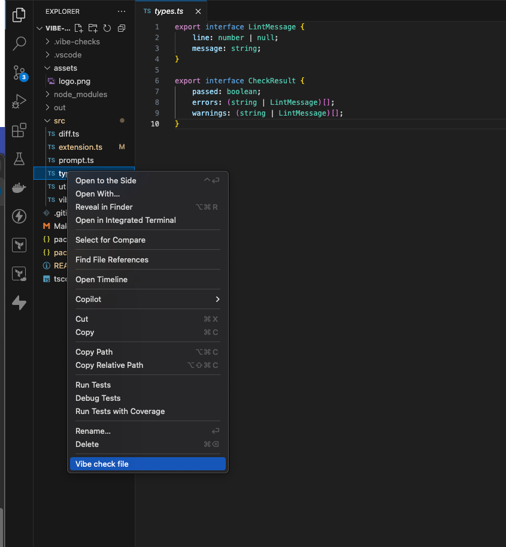

**Natural-Language Linter for Your Codebase**

Vibe Checks lets you define rules in plain Markdown and then uses an LLM to enforce them. Think of it as a _**vibe check**_ for your code: set the mood, and let AI do the rest.

---
## Why? I have ESlint
Yeah, so do I. But sometimes there are guidelines that are difficult to verify programatically, but simple to explain in words.

---

## Getting Started

### Requirements
You must have some extension that provides a Language model via the [VSCode Language Model API](https://code.visualstudio.com/api/extension-guides/language-model). I use [Github Copilot](https://marketplace.visualstudio.com/items?itemName=GitHub.copilot), but there are probably others.

### 1. Install the Extension

- Install from the [Marketplace](https://marketplace.visualstudio.com/items?itemName=Alfredvc.vibe-checks) or directly in VSCode.

### 2. Configure Your Language Model

- Run `Vibe Checks: Choose Model` from the Command Palette (`Ctrl+Shift+P`)
- Select your preferred language model
- The model is saved in your workspace settings

### 3. Add Review Instructions

- Create a `.vibe-checks` folder in your workspace root (or set a custom path)
- Add one or more `.md` files with your review rules
- You can organize rules by topic (e.g., `style-guide.md`, `security.md`)
- Use markdown headings (e.g., `## JavaScript`) for language-specific rules (must be in the exact format `## language`)

**Example: `.vibe-checks/typescript-tips.md`**
```markdown
# Guidelines

## TypeScript
- When creating constant objects or arrays, use as const to make them truly immutable.
- Instead of duplicating code, use utility types like Partial, Pick and Omit.
- Use `never` to ensure all cases are handled in `switch` statements.
```

---

## Usage

- **Manual Check**: Run `Vibe Checks: Vibe check file` to check the active file
- **Repo Changes Check**: Run `Vibe Checks: Vibe check changes` to check all changed, staged, and new files (only staged) in your repository
- **Automatic Check**: Configure checks to run automatically ( experimental, not recommended )
- **File explorer**: Simply right click a file and `Vibe check file`


---
## Examples
In the examples folder you can find some examples of instructions.

### [Supabase functions](examples/supabase-functions.md)
Adapted from [supabase's own prompts](https://supabase.com/docs/guides/getting-started/ai-prompts/database-functions).

**This is an excellent example of why this extension is useful.**

---

## Commands

- `Vibe Checks: Vibe check file` — Run check on the active file
- `Vibe Checks: Vibe check changes` — Run checks on all changed, staged, and new files in the repository
- `Vibe Checks: Choose Model` — Select a language model
- `Vibe Checks: Clear Vibe Checks Cache` — Clear cached results

---

## Features

- [x] **Customizable Review Criteria**: Define your own review rules in markdown files
- [x] **In-Editor Feedback**: Errors and warnings appear in the editor itself
- [x] **Smart Caching**: Avoids redundant analysis by caching results
- [x] **Automatic Triggers**: Run checks on command, save, open, or change. (experimental, not recommended)
- [x] **Model Selection**: Easily choose from available language models
- [x] **Check all changes since last commit**
- [ ] **Fix the line number bug**

---

## Troubleshooting

- **"Language Model API not available"**: Update VSCode and ensure you have access to language models (e.g., Copilot subscription)
- **"Instructions folder not found"**: Create `.vibe-checks` in your workspace.
- **"No instructions found"**: Add at least one `.md` instruction file to your `.vibe-checks`.
- **Model not found**: Use `Vibe Checks: Choose Model` to select an available model
- **Other**: Try clearing the cache? 🤷

---

## Development

1. Clone the repository
2. Run `npm install`
3. Open in VSCode and press F5 to launch the development host

---
## Known bugs
Line numbers can be wrong some times.

---

## License

MIT License — see [License](LICENSE) file for details.